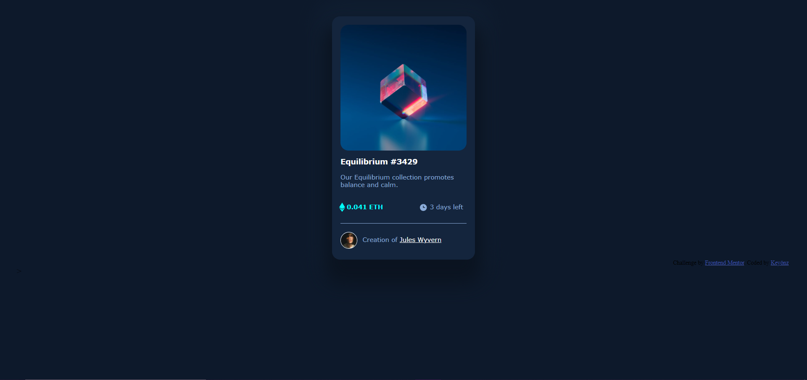

# Frontend Mentor - NFT preview card component solution

This is a solution to the [NFT preview card component challenge on Frontend Mentor](https://www.frontendmentor.io/challenges/nft-preview-card-component-SbdUL_w0U). Frontend Mentor challenges help you improve your coding skills by building realistic projects. 

## Table of contents

- [The challenge](https://www.frontendmentor.io/challenges/nft-preview-card-component-SbdUL_w0U)
- [Links](https://twitch.tv/keyonz_)
- [Built with](https://code.visualstudio.com)
- [Author](https://www.frontendmentor.io/profile/Keyoonz)

### The challenge

Users should be able to:

- View the optimal layout depending on their device's screen size
- See hover states for interactive elements

### Screenshot

)

### Links

- Solution URL: [https://www.frontendmentor.io/solutions/keyonz-nft-preview-card-component--aDrNh1T8](https://www.frontendmentor.io/solutions/keyonz-nft-preview-card-component--aDrNh1T8)
- Live Site URL: [https://nft-preview-card-component-keyonz.netlify.app/](https://nft-preview-card-component-keyonz.netlify.app/)

## My process

### Built with

- HTML5 
- CSS3

## Author

- Website - [Add your name here](https://twitch.tv/keyonz_)
- Frontend Mentor - [@yourusername](https://www.frontendmentor.io/profile/Keyoonz)
